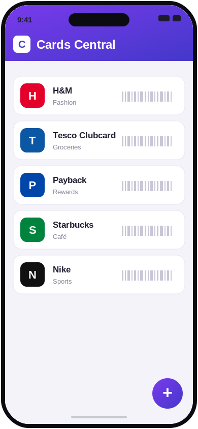
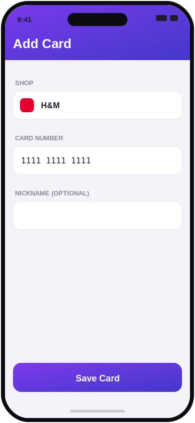
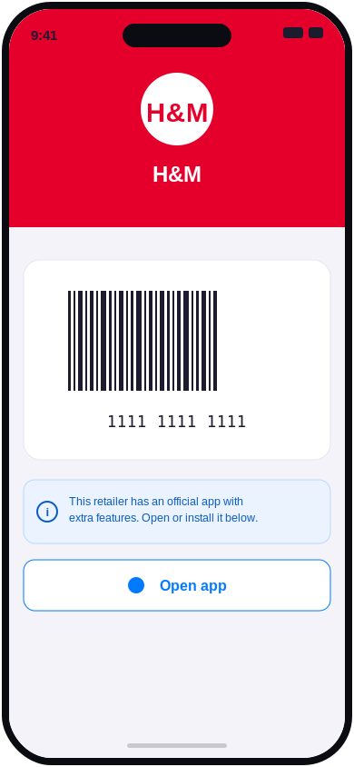

# Cards Central

Your loyalty cards in one place. A mobile app for storing and managing loyalty cards from retailers across Europe and popular worldwide brands. Pick your country and the app localizes itself and surfaces the shops most relevant to you.

<p align="center">
  <a href="https://cardscentral.github.io/"><strong>🌐 cardscentral.github.io — try it now, no install needed →</strong></a>
</p>

<p align="center">
  
  
  
</p>

## Try it now (no install needed)

Head to **[cardscentral.github.io](https://cardscentral.github.io/)** and tap **[Open the web app](https://cardscentral.github.io/app/)** — it's an installable **PWA**, so there's nothing to download and no app store account required. Your data stays on your device.

To install it on your phone:


- **iPhone/iPad (Safari):** tap **Share → Add to Home Screen**
- **Android (Chrome):** tap **⋮ → Install app / Add to Home Screen**
- **Desktop (Chrome/Edge):** click the **install** icon in the address bar

Once added, it launches full-screen like a native app and works offline.

## Features

- **List & manage** your loyalty cards
- **Scan barcodes** with your camera to add cards instantly
- **Shop branding** — each card displays in the shop's brand colors
- **Multiple barcode types** — EAN-13, Code 128, QR codes, and more
- **Community-driven shop list** — anyone can add a new shop with a single file

## Add a shop (the easy way to contribute!)

Missing your favorite store? Adding one is the most welcome contribution — and it only takes **one small file, no coding required**. You can even do it right in the GitHub web editor.

### 1. Add a YAML file

Create a new file at `src/config/shops/<shop-id>.yaml`. Copy this template and fill it in:

```yaml
id: my-shop          # Unique identifier, kebab-case (e.g. "tesco", "dm-cz")
name: "My Shop"      # Display name shown in the app
description: "My Shop Loyalty Card"
country: SK          # ISO country code (SK, CZ, DE, PL, ...)
category: fashion    # fashion, groceries, electronics, petrol, pharmacy, home, sports, other
barcode_type: ean13  # ean13, ean8, code128, code39, qr, pdf417, aztec
brand:
  primary_color: "#FF0000"    # Main brand color (used as the card background)
  secondary_color: "#FFFFFF"  # Secondary color
  text_color: "#FFFFFF"       # Text/icon color on top of the primary color
  logo: siMyshop              # Optional — see "Finding a logo" below
```

Not sure about a value? Open any existing file in [`src/config/shops/`](src/config/shops/) to see real examples, or just leave the optional fields out.

> **Finding a logo:** go to [simpleicons.org](https://simpleicons.org/), search for the brand, and use `si` + the icon name in PascalCase — e.g. "Lidl" → `siLidl`, "H&M" → `siHandm`. If the brand isn't listed, simply omit the `logo` field and the app will show the first letter of the shop name in its brand colors.

### 2. (Optional) Link the shop's official app

If the store has its own app, you can add an `apps` block so users can jump to it:

```yaml
apps:
  ios:
    store_id: "834465911"        # App Store numeric id
  android:
    package: "com.hm.goe"        # Play Store package id
    scheme: "hmapp://"           # optional deep-link scheme
```

The app only shows the store button once the reference is confirmed to exist, so it's fine to leave this out if you're unsure.

### 3. Open a Pull Request

That's it! Submit your PR and a maintainer will review it. Not comfortable with pull requests? No problem — [open an issue](https://github.com/cardscentral/cardscentral/issues/new) with the shop details and we'll add it for you.

## Running locally

Want to work on the app itself? You'll need **Node.js 20+** and npm.

```bash
git clone https://github.com/cardscentral/cardscentral.git
cd cardscentral
npm install

npm start        # start the dev server
npm run ios      # run on iOS
npm run android  # run on Android
npm run web      # run in the browser
```

After adding or editing a shop YAML file, regenerate the registry:

```bash
npm run generate:shops
```

To run the installable PWA locally (with the service worker on):

```bash
npm run build:web && npm run serve:web   # → http://localhost:4173/cardscentral/
```

## Running the tests

**Native (iOS/Android)** flows use [Maestro](https://maestro.mobile.dev/). Install it once with `curl -fsSL "https://get.maestro.mobile.dev" | bash`, boot a simulator/emulator with the app installed, then:

```bash
make maestro-ios                      # run all flows on iOS
make maestro-android                  # run all flows on Android
make maestro-flow FLOW=02-add-card    # run a single flow
```

**Web / PWA** flows use [Playwright](https://playwright.dev/) and run against the production web build — no simulator needed, so they're the quickest way to check UI changes:

```bash
make e2e-web-install   # one-time: install the headless browser
make e2e-web           # build, serve dist/, and run the whole suite
make e2e-web-ui        # interactive UI mode
```

The web specs (`e2e-web/`) are numbered to match the Maestro flows (`.maestro/flows/`), so the shared UI logic is covered on both sides. Run `make help` to see all available targets. For CI/deploy details, see **[CONTRIBUTING.md](CONTRIBUTING.md)**.

## Tech Stack

- **Framework:** React Native with Expo
- **Language:** TypeScript
- **Storage:** on-device (your data never leaves your phone)
- **Testing:** Maestro (native) + Playwright (web/PWA)

## License

This project is licensed under the MIT License — see the [LICENSE](LICENSE) file for details.
